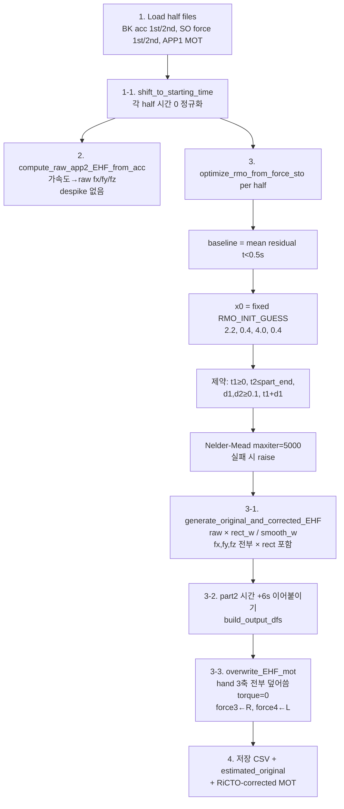

# RiCTO 핵심 비교: `get_optimized_solution_and_EHF.py` vs `ricto_core.py`

- **작성일**: 2026-09-10
- **본 문서 위치**: `Codes/COMPARE_ricto_core_vs_get_optimized_solution_and_EHF.md`

## 원본 파일 로컬 위치


| 구분                   | 역할                   | 로컬 경로                                                                             |
| -------------------- | -------------------- | --------------------------------------------------------------------------------- |
| **구버전 (RMO)**        | 학회 투고 데이터 처리 배치 스크립트 | `E:\Dropbox\SEL\BOX\Codes\BOX_2_RiCTO\pipeline\get_optimized_solution_and_EHF.py` |
| **신버전 (RiCTO core)** | 이후 수정·정리한 핵심 알고리즘 모듈 | `E:\Dropbox\SEL\BOX\Codes\BOX_2_RiCTO\ricto_core.py`                              |


- 이하 **RMO 스크립트** = 구버전 (`get_optimized_solution_and_EHF.py`), 과거 명칭 **RMO**
- 이하 **ricto_core** = 신버전 (`ricto_core.py`), 현재 명칭 **RiCTO**


## 0. 한 줄 결론

**EHF 이벤트 최적화의 수학적 골격은 같다.**  
둘 다 `(t1, d1, t2, d2)` 를 Nelder–Mead 로 맞추고, 목적함수는


J = \sum_t \big( r(t) - b(1 - w_{\mathrm{smooth}}(t;t_1,d_1,t_2,d_2)) \big)^2


이며, 같은 params 로 `rect_w`(pre) / `smooth_w`(post) 를 파생한다.

다만 **baseline 정의, 초기값, 제약, 잔차 전처리, 가속도 despike, MOT에 쓰는 축, 좌우 컬럼 매핑** 등 **전처리·수치 디테일은 바뀌었다.**  
“근본적으로 같은 아이디어인가?” → **예.**  
“같은 수치 결과를 내는가?” → **아니오 (의도적 robust 화 + 적용 범위 축소).**

## 1. 파일 역할 차이 (범위)


|         | RMO 스크립트                                                     | ricto_core                          |
| ------- | ------------------------------------------------------------ | ----------------------------------- |
| 성격      | 학회용 **배치 파이프라인** (I/O·half-split·CSV/MOT 저장)                 | **알고리즘 커널만** 추출한 자립 모듈              |
| 입력      | 하드코딩된 SUB1 OneCycle 경로 (BK half sto, SO half sto, APP1 mot)  | 이미 준비된 배열 (residual, acc, APP1 mot) |
| 출력      | `estimated_original.mot`, `RiCTO-corrected.mot`, summary CSV | `ric`, `pre`, `post` 배열             |
| 오케스트레이션 | `process_trial()` 가 전부                                       | `ricto_correct_segment()` 한 세그먼트    |


즉 ricto_core 는 RMO 스크립트의 “주변부”를 걷어내고 **핵심만** 남긴 뒤, 그 핵심 안에서 **robust 화**를 한 버전이다.

## 2. 공통으로 유지된 핵심 (근본적으로 안 바뀐 것)

1. **의사결정 변수**: `[t1, d1, t2, d2]` (그립 시작, 전이폭↑, 릴리스 시작, 전이폭↓)
2. **Weight**
  - `smoothstep_ramp`: 3\tau^2 - 2\tau^3, `duration < 0.01` 이면 step
  - `smooth_w = clip(ramp_up - ramp_down, 0, 1)`
  - `rect_w = 1` on `[t1, t2+d2]`, else `0` (`d1` 은 rect 에 미사용)
3. **목적함수 구조**: residual 을 `baseline * (1 - smooth_w)` 로 설명 (최적화는 **smooth만** 사용)
4. **솔버**: `scipy.optimize.minimize(..., method="Nelder-Mead")`
5. **pre/post 파생**: 한 번 최적화 → 같은 params 로 rect / smooth 둘 다 생성
6. **EHF 크기**: 양손 균등, m = m_{\mathrm{box}}/2,
  `fy = -(m * (ay - g))`, x/z 부호 규칙도 동일 계열
7. **로드셀로 이벤트를 잡지 않음** (residual 기반)

→ 사용자의 판단(“근본적으로는 바뀌지 않았다”)은 **이 골격에 한해 맞다.**

## 3. 프로세스 플로우 비교 (절차 순서)


### 3.1 RMO 스크립트 — 학회 파이프라인

원본: `E:\Dropbox\SEL\BOX\Codes\BOX_2_RiCTO\pipeline\get_optimized_solution_and_EHF.py`




절차 나열:

1. **로드**: 12s OneCycle 을 **1st/2nd half** 로 나눈 BK acc·SO force sto + APP1 ExtLoad mot
2. **시간 정규화**: half 별로 `time -= time[0]`
3. **Raw EHF**: 손 가속도 × 질량 (despike **없음**)
4. **RMO (half별)**:
  - baseline = `t < 0.5` 구간 residual 평균
  - 고정 초기값 `[2.2, 0.4, 4.0, 0.4]`
  - soft 제약 (범위 밖 → `1e9`)
  - 목적함수에 residual **raw 그대로** (median filter 없음)
  - `success=False` 이면 예외
5. **가중 EHF**: `orig_* = raw * rect_w` (fx/fy/fz), `corr_fy = raw_fy * smooth_w`
6. **half 결합**: part2 시간에 `part1_end + 0.001` 오프셋
7. **MOT 기록**: APP1 mot 복사 후 손 **vx,vy,vz** 덮어쓰기, torque 0
  - 컬럼: `hand_force3 ← right`, `hand_force4 ← left` (주석/관례와 반대일 수 있음)
8. **저장**


### 3.2 ricto_core — 이후 커널

원본: `E:\Dropbox\SEL\BOX\Codes\BOX_2_RiCTO\ricto_core.py`

```mermaid
flowchart TD
  A[입력 배열 가정<br/>residual, hand acc Nx3,<br/>APP1 mot matrix] --> B[1. clean_acc<br/>|a|>30 → median21 치환]
  B --> C[2. compute_pre_ricto_ehf<br/>fx/fy/fz 재구성]
  A --> D[3. optimize_ricto_robust]
  D --> D0[residual median filter<br/>window ≈ 0.10/dt]
  D0 --> D1[baseline = 상위 30% 평균<br/><10 이면 max로 하한]
  D1 --> D2[잔차<0.4·baseline 구간으로<br/>최장 접촉 → t1i,t2i 초기값<br/>실패 시 0.25/0.75·T]
  D2 --> D3[하드 박스 제약<br/>d∈[0.05,0.6], t 범위,<br/>t1+d1<t2]
  D3 --> D4[목적: clip된 SSE<br/>cap=max(5|b|,500)<br/>Nelder-Mead maxiter=20000<br/>실패해도 x 사용+clip]
  D4 --> E[4. apply_ricto_to_extload<br/>손 **vy만** w×fy<br/>지면/수평/모멘트/COP 유지]
  E --> F[pre=rect, post=smooth 반환]
```


절차 나열:

1. **입력**: 세그먼트 단위 배열 (파일 I/O·half 결합은 바깥)
2. **가속도 despike**: `|a| > 30` 만 21-frame median 으로 교체 ← **신규**
3. **Raw EHF**: 동일 질량·부호 규칙
4. **RiCTO robust 최적화**:
  - residual **median filter** ← **신규**
  - baseline = 필터 잔차 **상위 30% 평균** (+ 하한 10) ← **변경**
  - 데이터 기반 초기 `t1i,t2i` + `d=0.20` ← **변경** (고정 guess 제거)
  - 제약 박스 + 목적함수 **clip** ← **변경**
  - 더 많은 iteration; 실패해도 clip 된 `x` 사용 ← **변경**
5. **MOT 적용**: **손 수직(vy)만** `w * fy` 로 교체 ← **변경**
  (주석: 지면·손 수평·모멘트·COP 불변)
6. **컬럼**: `hand_force3_vy ← L`, `hand_force4_vy ← R` ← RMO 스크립트와 **좌우 반대**


## 4. 최적화(RMO → RiCTO) 디테일 대조표


| 항목           | RMO 스크립트               | ricto_core                                    | 근본 동일?       |
| ------------ | ---------------------- | --------------------------------------------- | ------------ |
| 변수           | t1,d1,t2,d2            | 동일                                            | ✅            |
| Weight 정의    | smoothstep / rect      | 동일                                            | ✅            |
| 목적함수 형태      | r - b(1-w_s) SSE       | 동일 + **diff clip**                            | ✅ 골격 / ⚠️ 수치 |
| baseline     | `mean(r | t<0.5)`      | median-filter 후 **상위 30% 평균**, `<10` 이면 `max` | ❌ 전처리        |
| residual 전처리 | 없음                     | median filter (~0.1 s)                        | ❌            |
| 초기값          | 고정 `[2.2,0.4,4.0,0.4]` | 잔차 접촉구간 검출 → `[t1i,0.2,t2i,0.2]`              | ❌            |
| d 하한         | 0.1                    | 0.05                                          | ⚠️           |
| d 상한         | 없음 (objective만)        | 0.6                                           | ⚠️           |
| t 범위         | t1≥0, t2≤part_end      | seg 길이 기반 박스                                  | ⚠️           |
| maxiter      | 5000                   | 20000                                         | ⚠️           |
| 실패 처리        | raise                  | clip 후 진행                                     | ⚠️           |
| 솔버           | Nelder-Mead            | Nelder-Mead                                   | ✅            |


**해석**: “이벤트를 residual 로 fit 한다”는 **동일**.  
baseline/초기값/robust 장치가 바뀌어 **같은 residual 시계열을 넣어도 t1,t2 가 달라질 수 있다.**

## 5. 전처리·적용 단계 변경 (사소해도 process에 영향)


### 5.1 가속도 → EHF


| 항목       | RMO            | ricto_core     |
| -------- | -------------- | -------------- |
| despike  | 없음             | `clean_acc` (` |
| 질량 분배    | m/2            | 동일             |
| fy 식     | `-(m*(ay-g))`  | 동일             |
| fx/fz 부호 | Lx·Rz/Lz 특수 부호 | 동일 계열          |


### 5.2 MOT 기록 (중요)


| 항목      | RMO                                               | ricto_core                 |
| ------- | ------------------------------------------------- | -------------------------- |
| 덮는 축    | ++hand **vx, vy, vz** (pre는 fx/fy/fz 전부 × rect)++ | ++**vy만** (post/pre 모두)++  |
| 수평력     | rect 게이트된 추정값으로 **교체**                            | ++APP1 원본 **유지++**         |
| torque  | 0 으로 강제                                           | ++건드리지 않음 (원본 유지)++        |
| 템플릿 MOT | APP1 (로드셀)                                        | ++APP1++                   |
| L/R 매핑  | force3←**R**, force4←**L**                        | force3←**L**, force4←**R** |


ricto_core 헤더 주석(“손 수직력만 보정”)과 RMO의 `overwrite_EHF_mot` 는 **여기서 갈라진다.**  
학회 MOT(`estimated_original` / `RiCTO-corrected`)는 **RMO 규칙**으로 만들어졌다.

### 5.3 세그먼트 / 시간 구조


| 항목      | RMO                                     | ricto_core     |
| ------- | --------------------------------------- | -------------- |
| 단위      | 12s OneCycle → **half 2번** RMO 후 concat | **세그먼트 1회** 호출 |
| 시간 이어붙임 | part2 `+ part1_end + 0.001`             | 호출자 책임         |
| I/O     | 경로·CSV·MOT 저장                           | 없음             |


### 5.4 ricto_core 가 명시적으로 **바깥**에 둔 전처리

헤더에 “pre/post/GT에 동일 적용, RiCTO 본체가 아님”으로 적힌 것:

- scaling, seeded IK, marker weight, SYNC_OVERRIDE, segmentation  
- 마커 Butterworth, distal-arm 3 Hz lowpass  
- SO/JR 실행, EXCLUDE_SEGS, plot

RMO 스크립트도 이 단계들을 파일 안에 두지 않고, **이미 PostSim 된 BK/SO half** 를 읽는다.  
차이는 “무엇을 커널 안으로 끌어왔는가” (despike·robust RMO) 이다.

## 6. 함수 매핑


| 기능                   | RMO 스크립트                                        | ricto_core                              |
| -------------------- | ----------------------------------------------- | --------------------------------------- |
| smoothstep           | `smoothstep_ramp`                               | `smoothstep_ramp`                       |
| smooth / rect weight | `smooth_weight_curve(t, params)`                | `smooth_weight_curve(t, t1,d1,t2,d2)`   |
| 최적화                  | `optimize_rmo_from_force_sto` + `rmo_objective` | `optimize_ricto_robust`                 |
| raw EHF              | `compute_raw_app2_EHF_from_acc`                 | `compute_pre_ricto_ehf` (+ `clean_acc`) |
| 가중·결합                | `generate_original_and_corrected_EHF`           | (최적화 반환 + apply)                        |
| MOT 적용               | `overwrite_EHF_mot`                             | `apply_ricto_to_extload`                |
| 엔트리                  | `process_trial`                                 | `ricto_correct_segment`                 |


## 7. 판정 요약


### 7.1 “핵심 최적화는 근본적으로 같나?”

**예 — 아이디어·목적함수 골격·weight 정의·pre=rect/post=smooth 파생은 동일.**

### 7.2 “그럼 구현이 같은가?”

**아니오.** 아래는 process flow 상 **실효 변경**:

1. residual **median filter** 추가
2. baseline: `t<0.5 평균` → **상위 30% + 하한**
3. 초기값: **고정 guess** → **잔차 기반 접촉 검출**
4. 제약·clip·maxiter·failure 정책 변경
5. 가속도 **despike** 추가
6. MOT: **3축 덮어쓰기** → **vy만**
7. 손 L/R 컬럼 매핑 **반대**
8. 파이프라인: half-concat 배치 → 세그먼트 API

학회에 쓴 숫자/MOT 를 재현하려면 **RMO 스크립트 쪽 규칙**을 따라야 하고,  
이후 production 으로 정리된 커널은 **ricto_core** 이다.

## 8. 이 레포로 이식할 때 권장 선택 (참고)


| 목표                                    | 권장 기준 구현                                                    |
| ------------------------------------- | ----------------------------------------------------------- |
| 학회 결과 재현 / `estimated_original` 비트 일치 | RMO 스크립트 (`get_optimized_solution_and_EHF.py`)              |
| 이후 논문·Asymmetric 파이프라인 표준             | `ricto_core.py` (+ 좌우·vy-only 정책을 PATH_RULE/ExtLoad 규칙에 명시) |
| 둘 다 필요                                | 코어는 ricto_core, `legacy_rmo=` 플래그로 baseline/init/MOT축 분기    |


이식 전 합의할 체크리스트:

- [ ] baseline / init 을 ricto_core 로 갈지, RMO 재현 모드를 남길지  
- [ ] MOT 에 **vy만** 쓸지, RMO처럼 **fx/fy/fz** 쓸지  
- [ ] `hand_force3/4` = L/R 매핑을 어느쪽으로 고정할지  
- [ ] despike (`|a|>30`) on/off  
- [ ] 세그먼트 단위 호출 vs OneCycle half-split  