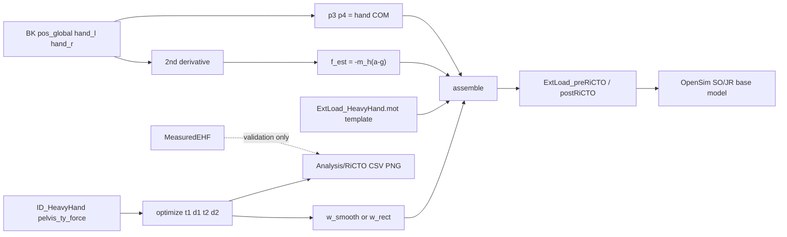

# RiCTO 최적화 모듈 계획 (비판적 검토 → 결정 → 구현)

- **작성일**: 2026-09-11
- **위치**: `Codes/c_Run_Tools/optimization/`
- **목표**: MeasuredEHF(손 로드셀) 없이 preRiCTO / postRiCTO ExtLoad를 생성하고, 논문용 분석 산출물을 `Analysis/`에 분리 저장한다.

## 0. 연구 목적 (왜 RiCTO인가)

현장/비전 기반 연구에서 로드셀 박스(MeasuredEHF)는 생태학적 타당성이 낮다.
HeavyHand(APP2)처럼 추가질량을 상시 얹으면 Grip–Deposit 전이가 step 함수가 되어 pelvis residual과 L5/S1 부하가 과대추정된다.
RiCTO(구 RMO)는 residual 시계열만으로 전이 파라미터 `(t1,d1,t2,d2)`를 찾고, BK 손 운동학으로 손 외력(EHF)을 재구성한 뒤 smooth/rect weight를 곱해 ExtLoad에 넣는다.

**Sensorless 원칙**: pre/postRiCTO MOT 생성 경로에는 MeasuredEHF 손 힘·토크·COP가 들어가면 안 된다. MeasuredEHF는 검증(GT 접촉시각, RMSE/r) 전용이다.

## 1. 레거시 vs 본 모듈 (비판적 요약)

| 항목 | 구 RMO (`d_Optimization/get_optimized_solution_and_EHF.py`) | `ricto_core.py` (후배 수정) | **본 모듈 결정** |
|------|--------------------------------------------------------------|-----------------------------|------------------|
| MOT 템플릿 | APP1(MeasuredEHF) 복사 | APP1 복사 | **HeavyHand MOT** (GRF만 유지) |
| 덮는 축 | fx,fy,fz (rect/smooth) | **vy만** | **fx,fy,fz 전부** (`w·f_est`) |
| torque | 0 강제 | APP1 유지 (누출) | **0 강제** |
| COP (p3/p4) | APP1 유지 (누출) | APP1 유지 | **BK hand COM** |
| 좌우 | force3←R, force4←L (**오류**) | 3←L, 4←R | **3=L, 4=R** |
| 축 부호 | fx_l / fz에 `-(-m a)` | 동일 계열 | **`f = −m_h(a−g)` 통일**, 축별 −1 제거 |
| 가속도 | BK `acc_global` (또는 사전 업샘플) | BK acc + despike | **`pos_global` 2차 미분** (despike OFF) |
| baseline | `mean(r, t<0.5)` | median top-30% | **`B = m_box·g`** (+ 진단용 edge mean) |
| 잔차 소스 | SO `residual_pelvis_ty` | SO | **ID `pelvis_ty_force` 기본**, SO fallback |
| 솔버 | Nelder–Mead | Nelder–Mead | **플러그인** (NM / least_squares / DE / grid+local) |

## 2. 조사 근거 (결정의 증거)

레포/파이프라인에서 확인된 사실:

1. **좌우 매핑**: ExtLoad SETUP XML에서 `lefthand → hand_force3`, `righthand → hand_force4`. plate 3=왼손, 4=오른손.
2. **힘 부호**: 접촉 중 MeasuredEHF `hand_force3_vy`는 음수(박스가 손에 가하는 힘, ground frame). `f = −m_h(a−g)`와 일치. 구 RMO의 축별 −1은 플롯 관례이며 OpenSim 입력에 쓰면 안 됨.
3. **BK `acc_global` 문제**: BodyKinematics 가속도 출력은 `pos_global` 수치미분과 불일치하는 경우가 있음 → 가속도는 pos 2차 미분으로 산출. `|a|>30` despike는 잘못된 acc를 덮는 응급조치였을 가능성이 높아 **기본 OFF**.
4. **잔차**: ID `pelvis_ty_force`와 SO `residual_pelvis_ty`는 실질적으로 동일(corr≈1). ID 커버리지가 더 넓으면 ID를 기본으로 사용.
5. **baseline 물리**: 비접촉 잔차 ≈ `m_box·g` (HeavyHand가 항상 얹어둔 추가질량).
6. **시간축**: MOT(1000 Hz)와 ID/BK(100 Hz)의 `t0`가 수 ms 어긋날 수 있음 → **절대 세그먼트 시각 유지** (구 RMO의 `time -= time[0]` 지양).

## 3. 사용자 질문 7개 → 결정

### 3.1 MeasuredEHF 누출
- **문제**: `ricto_core.apply_ricto_to_extload`는 APP1 복사 후 vy만 교체 → vx/vz/torque/COP가 측정값.
- **결정**: 손 12개 컬럼(힘·점·토크)은 전부 운동학 유래. 지면반력만 HeavyHand(=측정 GRF) 유지.

### 3.2 torque = 0
- **이유**: 선가속도만으로 박스 각가속도·관성·접촉점 모멘트 산출 불가. HeavyHand 시나리오와 동일.
- **결정**: `hand_torque3_* = hand_torque4_* = 0`.

### 3.3 왼손/오른손
- **결정**: `hand_force3 = L`, `hand_force4 = R`. 구 RMO 학회 MOT의 좌우 반전은 한계로 기록.

### 3.4 축 부호
- **결정**: 3축 모두 `f = −m_h (a − g_vec)` (`g_vec = (0, g_y, 0)`, `g_y = −9.8066`).
- **검증**: `validate_ricto.py`에서 (a) 정적 더미 `a=0 → f=(0,−m_h|g|,0)`, (b) +X 가속 시 `f_x<0`, (c) 실데이터 접촉구간 `corr(f_est, f_meas)` 부호.

### 3.5 despike
- **결정**: 기본 OFF. `|a| > a_max`(기본 30) 개수만 QC 로그. 0이 아니면 경고, 치환하지 않음.

### 3.6 baseline
- **비교**: (a) `t<0.5` 평균 — 단순하나 세그먼트 초반이 항상 비접촉이 아닐 수 있음. (b) median top-30% — 동적 피크에 과대추정·폴백 근거 약함. (c) `B = m_box·g` — 물리적으로 명확.
- **결정**: **(c) 기본**. 진단으로 양끝 0.5 s edge mean을 병기. `B_edge/B_theory`가 ±15% 밖이면 경고.

### 3.7 Nelder–Mead
- **장점**: 도함수 불필요, 4변수, 목적함수가 조각적 매끄러움.
- **단점**: bounds 미지원(1e9 페널티 → simplex 붕괴), 지역해/초기값 의존, `xatol=1e-6`은 10 ms 샘플 대비 과잉.
- **후보**: `least_squares(TRF, bounds, soft_l1)`, `differential_evolution`, `grid(t1,t2)→Powell/NM`.
- **결정**: 솔버 플러그인. 기본은 `least_squares`(경계·잔차벡터 자연스러움). 로드셀 접촉시각 GT로 비교 후 md에 결과 반영·필요 시 default 변경.

## 4. 가정 (ASSUMPTION)

1. 접촉 중 손 COM 가속도 ≈ 박스 가속도(강체 결합).
2. 양손 질량 분배 `α = 0.5` (비대칭 α 최적화는 Strategy A 확장으로 보류).
3. 잔차 신호 = ID `pelvis_ty_force` (없으면 SO `residual_pelvis_ty`).
4. 연구 범위 = **손 로드셀 제거**; GRF는 측정값 사용.

## 5. 데이터 플로우



## 6. 최적화 세팅

- 변수 `θ = [t1, d1, t2, d2]`, 재매개화 `t2 = t1 + d1 + Δ`, `Δ ≥ Δ_min`.
- `w = clip(s(t;t1,d1) − s(t;t2,d2), 0, 1)`, 모델 `r(t) ≈ B(1−w)`.
- Bounds: `d ∈ [0.05, 0.8]`, `t1 ∈ [t0+0.05, T−0.5]`, `Δ ≥ 0.1`.
- 초기값: 잔차 `< 0.5B` 최장 구간; 실패 시 grid.
- 손실: SSE 기본, soft_l1 옵션.
- preRiCTO = `rect_w · f_est`, postRiCTO = `smooth_w · f_est`.

## 7. 산출물 경로

### 7.1 OpenSim 입력 (ExtLoad)

레거시 OneCycle 레이아웃:

- `OpenSim/_Main_/c_AddBio_Continous/<SUB>/OneCycle_TrcMot/<base>_ExtLoadAPP2_estimated_original.mot` → **preRiCTO**
- `..._ExtLoadAPP2_RiCTO-corrected.mot` → **postRiCTO**

현대 `OpenSim_Process` 레이아웃(있으면):

- `.../ExtLoad/SUB?_<cond>_<seg>_ExtLoad_preRiCTO.mot`
- `.../ExtLoad/SUB?_<cond>_<seg>_ExtLoad_postRiCTO.mot`

### 7.2 분석 산출물

`Analysis/RiCTO/<protocol>/<SUB>/<cond>/`

- `*_timeseries.csv`: residual, w_rect, w_smooth, f_est_xyz_L/R, (optional) f_meas, p_hand
- `*_summary.csv`: t1,d1,t2,d2,B,B_theory,cost,solver,nfev,success, QC
- 선택적 PNG

경로 API (기존 `Codes/PATH_RULE.py`에 **최소 추가**):

- 모듈 상수 `ANALYSIS_DIR`
- `ResultPaths.analysis_dir(*parts)`
- `ConditionPaths.analysis_dir` / `ricto_summary_path` / `ricto_timeseries_path` / `ricto_plot_path`

레거시 OneCycle 헬퍼는 PATH_RULE에 넣지 않고 `optimization/legacy_paths.py`에 둔다.

## 8. 모듈 구조

```
Codes/c_Run_Tools/optimization/
├─ RICTO_PLAN.md
├─ __init__.py
├─ ricto_config.py
├─ ricto_io.py
├─ ricto_ehf.py
├─ ricto_optimize.py
├─ ricto_extload.py
├─ run_ricto.py
└─ validate_ricto.py
```

## 9. 검증 계획 & 합성 결과

1. **부호 더미** (`validate_ricto.py --dummy`): 정적/가속 케이스.
2. **솔버 비교**: 동일 residual에 NM / least_squares / DE / grid+local → cost, t1/t2, nfev, 시간.
3. **로드셀 접촉시각**(데이터 있을 때): MeasuredEHF |Fy| threshold onset vs `(t1, t2+d2)`.
4. **MOT 무누출 검사**: pre/post MOT의 hand_torque=0, hand force가 MeasuredEHF와 동일하지 않음.
5. OpenSim 연계: ExtLoad SETUP → SO/JR (베이스 모델).

### 9.1 부호 더미 (PASS, 2026-09-11)

| 케이스 | 기대 | 결과 |
|--------|------|------|
| `a=0`, m_h=3.5 kg | `f=(0, −34.323, 0)` | PASS |
| `a_x=+2` | `f_x < 0` (`−7.0 N`) | PASS |

### 9.2 합성 residual 솔버 비교 (truth t1=1.5, t2=4.0, B=68.65)

| solver | cost | err_t1 (s) | err_t2 (s) | nfev | elapsed (s) |
|--------|------|------------|------------|------|-------------|
| nm | 591.26 | −0.005 | +0.001 | 290 | 0.010 |
| **least_squares** | 591.35 | −0.005 | +0.001 | **14** | **0.005** |
| de | 591.26 | −0.005 | +0.001 | 2815 | 0.133 |
| grid_local | 591.26 | −0.005 | +0.001 | 233 | 0.017 |

**채택**: `least_squares` 를 기본 솔버로 유지 (경계 지원, nfev·시간 최소, 오차 동급). DE는 전역 탐색이 필요할 때 옵션.

CSV: `Analysis/RiCTO/_validation/solver_compare_synthetic.csv`

### 9.3 Synthetic E2E

`run_ricto.py --synthetic` → `Analysis/RiCTO/_synthetic/` 에 pre/post MOT + summary. hand_torque 전부 0 확인.

## 10. 구현 체크리스트

- [x] 본 md 작성
- [x] `PATH_RULE.py` ANALYSIS_DIR / RiCTO 경로
- [x] config / io / ehf / optimize / extload
- [x] validate + run CLI
- [x] 합성 솔버 비교 결과를 §9에 기록 (`least_squares` 기본 확정)
- [x] `_c_Main_ricto.ipynb` 셀에서 `run_ricto.py` / `validate_ricto.py` 호출
- [ ] 실데이터(로드셀 접촉시각) 비교 — OpenSim 결과 파일이 있는 환경에서 추가

## 11. 건드리지 않는 것

- `d_Optimization/get_optimized_solution_and_EHF.py` 원본(참조만; 학회 재현용으로 유지)
- Dropbox 원본 `ricto_core.py`
- GRF 제거 / α 최적화 / Strategy B·C
